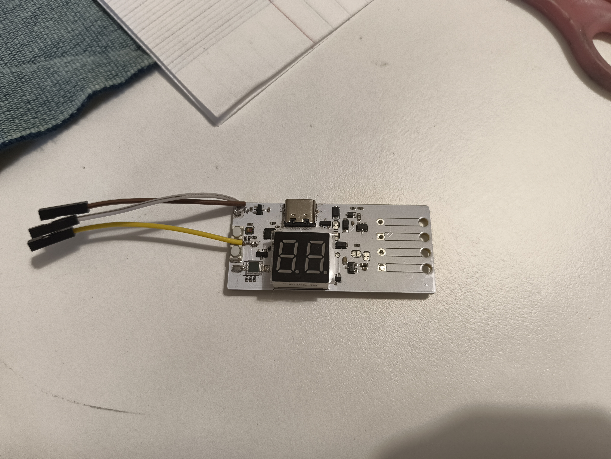
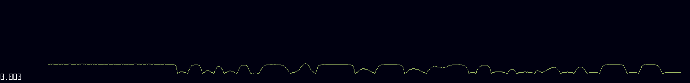
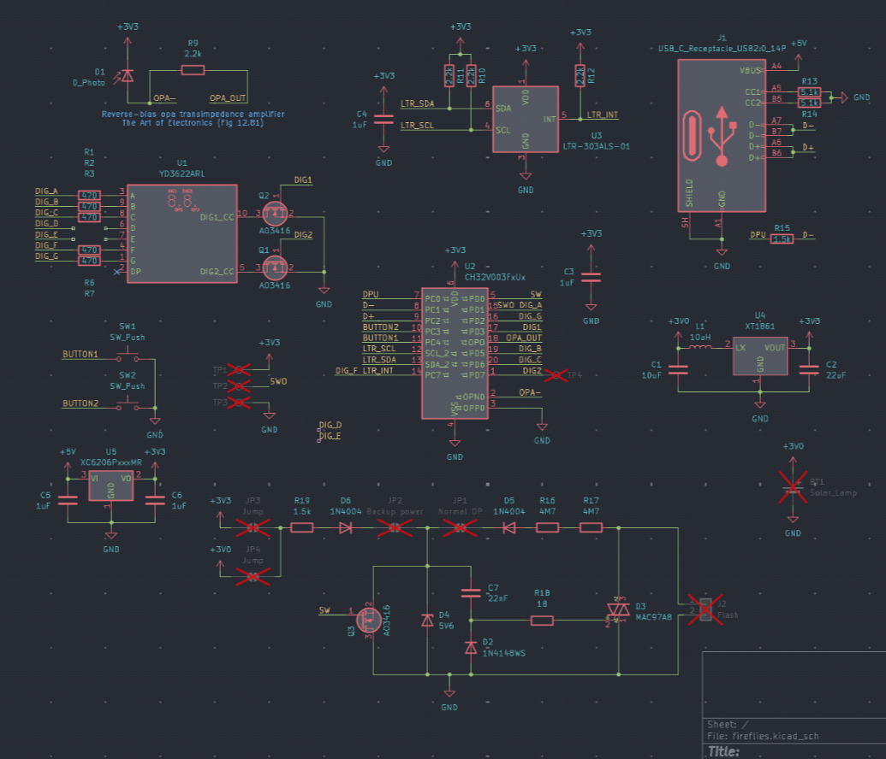
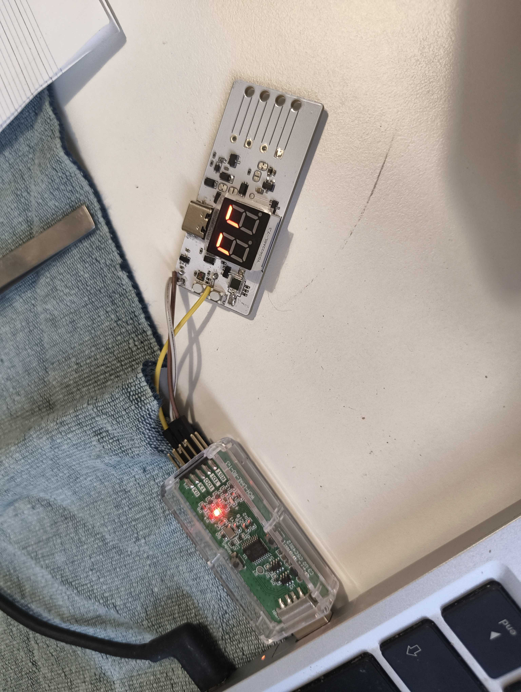

# Fireflies

Firefly PCBs powered by the CH32V003.

These boards periodically flashes a xenon flash based on a timer, which gets accelerated when it detects flashes from surrounding PCBs.

There are currently 2 flash-detection circuits undergoing testing:

1. A reverse-biased diode using the ch32v003's internal OPA & ADC for sampling

2. A I2C ambiant light sensor for more "advanced" applications

The flash trigger isolates the hi-voltage trigger and the low-voltage circuitarry with a triac circuit, and uses a mosfet to trigger the flash.

### Features:

- Dual light-sensor: one via i2c, one via photodiode
- USB via ch32usb
- 7 seg for number display
- Flash activation circuit (high voltage)
- Programming ports

### Usage

Check firmware folder

Here's an example output for detection light intensity with the photodiode:

It's reverse-biased btw

### Schematic

### Programming

Check diagram:

